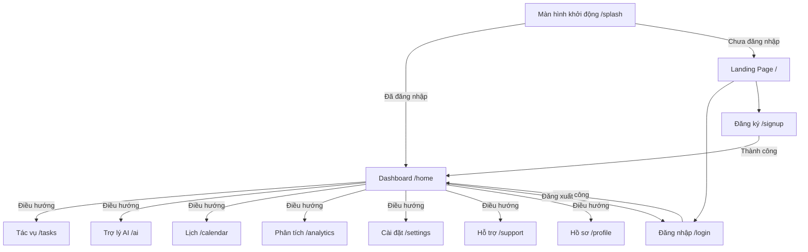

# NEXUS AI

**NEXUS AI** là workspace năng suất (productivity) cao cấp thế hệ mới, tích hợp Trí tuệ Nhân tạo (AI) giúp quản lý công việc, đo lường độ tập trung (focus metric), phân tích hiệu suất chuyên sâu và đưa ra gợi ý thông minh. Dự án tích hợp hệ thống xác thực bảo mật qua **Supabase Auth**, đồng bộ dữ liệu Realtime và cấu hình đa môi trường linh hoạt thông qua tệp tin **`.env`**.

> **Ghi chú quan trọng:**
>
> - Package name hiện tại của dự án: `to_do_app`.
> - Tên thương hiệu hiển thị trên UI ứng dụng: **NEXUS AI**.

---

## Mục lục

- [Tính năng nổi bật](#tính-năng-nổi-bật)
- [Kiến trúc luồng & Điều hướng](#kiến-trúc-luồng--điều-hướng)
- [Hệ thống Tech Stack](#hệ-thống-tech-stack)
- [Cấu trúc thư mục dự án](#cấu-trúc-thư-mục-dự-án)
- [Cấu hình môi trường](#cấu-hình-môi-trường)
- [Supabase: Database Schema & Bảo mật](#supabase-database-schema--bảo-mật)
- [Hướng dẫn chạy dự án](#hướng-dẫn-chạy-dự-án)
- [Các lệnh phát triển hữu ích](#các-lệnh-phát-triển-hữu-ích)
- [Xử lý sự cố (Troubleshooting)](#xử-lý-sự-cố-troubleshooting)
- [Bảo mật & Lưuý khác](#bảo-mật--lưu-ý-khác)

---

## Tính năng nổi bật

NEXUS AI cung cấp một bộ giải pháp quản lý công việc hoàn chỉnh và cao cấp với các tính năng vượt trội:

### 1. Trí tuệ nhân tạo (AI-Powered)
- **AI Suggestion Banner**: Đưa ra các gợi ý hành động hoặc nhiệm vụ thông minh dựa trên lịch sử hoạt động của người dùng.
- **AI Summary Block**: Tự động tóm tắt tiến độ công việc, chỉ ra các nút thắt cổ chai hiệu suất.
- **Smart Progress Timeline**: Trực quan hóa tiến độ hoàn thành mục tiêu thông qua dòng thời gian thông minh do AI tối ưu.
- **AI Insights Panel**: Phân tích sâu các thói quen làm việc và đề xuất lịch trình hoạt động tối ưu.
- **Floating AI Button**: Nút trợ lý AI lơ lửng luôn sẵn sàng để nhận lệnh hoặc giải đáp nhanh cho người dùng.

### 2. Quản lý tác vụ chuyên nghiệp (Advanced Task Management)
- **Interactive Kanban Board**: Hỗ trợ kéo thả và tổ chức công việc theo trạng thái (`todo`, `in_progress`, `done`).
- **Detail Task Side Panel**: Bảng chi tiết tác vụ trượt mượt mà cho phép chỉnh sửa tiêu đề, mô tả, mức độ ưu tiên (`low`, `medium`, `high`) và ngày hết hạn nhanh chóng.
- **Tasks Preview Overlay**: Xem nhanh thông tin chi tiết của task khi rê chuột hoặc nhấp chọn mà không làm gián đoạn luồng làm việc.
- **Command Palette**: Thanh lệnh tìm kiếm nhanh toàn hệ thống để tạo tác vụ, chuyển màn hình hoặc tìm nội dung tức thì.

### 3. Phân tích hiệu suất cao cấp (High-Fidelity Analytics)
- **Focus Score Card**: Đo lường điểm tập trung dựa trên thời gian làm việc sâu (Deep Work).
- **Productivity Chart**: Biểu đồ trực quan hóa số lượng công việc hoàn thành theo thời gian (tuần, tháng).
- **Category Breakdown**: Phân tích tỷ trọng công việc thuộc các nhóm kỹ năng hoặc danh mục khác nhau.
- **Responsive Dashboard Layouts**: Giao diện hiển thị chuyên biệt cho cả thiết bị di động (Mobile) và máy tính để bàn (Desktop).

### 4. Hồ sơ cá nhân & Cộng tác realtime (Profile & Collaboration)
- **Collaborator Presence**: Trực quan hóa trạng thái hoạt động theo thời gian thực (realtime presence indicator) của các cộng sự đang cùng tham gia dự án.
- **User Profile Dashboard**: Thống kê số ngày chuỗi (streak days), tổng số giờ tập trung (focus hours), phân tích chi tiết thời gian làm việc (deep work, admin, learning).

### 5. Trung tâm trợ giúp thông minh (Smart Support Platform)
- **AI Chat Widget**: Chatbot thông minh hỗ trợ giải đáp nhanh các thắc mắc về kỹ năng làm việc hoặc sử dụng app.
- **Proactive Ticket Form**: Biểu mẫu hỗ trợ gửi yêu cầu kỹ thuật trực tiếp tới đội ngũ phát triển.
- **Multi-channel FAQ & Knowledgebase**: Kho câu hỏi thường gặp và tài liệu hướng dẫn được thiết kế trực quan.

### 6. Ngôn ngữ thiết kế Premium
- **Glassmorphism & Radial Backgrounds**: Giao diện hiệu ứng kính mờ thời thượng, kết hợp cùng các chuyển động mượt mà của các điểm sáng nền (animated glow blobs).
- **Harmony Color Palettes**: Sử dụng hệ màu tối (dark mode) được thiết kế riêng giúp giảm mỏi mắt và tăng khả năng tập trung cao độ.

---

## Kiến trúc luồng & Điều hướng

Ứng dụng sử dụng cấu hình định tuyến thông minh thông qua gói `go_router` để tự động xử lý bảo vệ màn hình (route protection) dựa trên trạng thái xác thực của Supabase.



### Các đường dẫn điều hướng (Routes):
- `/splash`: Kiểm tra trạng thái phiên làm việc và chuyển hướng tương ứng.
- `/`: Landing page giới thiệu giải pháp Nexus AI.
- `/login` / `/signup`: Giao diện xác thực chuyên nghiệp với hiệu ứng ánh sáng nền di chuyển.
- `/home`: Dashboard chính trực quan hóa tổng quan nhiệm vụ và hiệu suất ngày.
- `/tasks`: Trình quản lý tác vụ toàn diện với bộ lọc chi tiết (chấp nhận tham số `newTask=1` hoặc `search=query`).
- `/analytics`: Hệ thống biểu đồ trực quan hóa chuyên sâu.
- `/settings`: Cấu hình tài khoản, bảo mật, thông báo và ứng dụng liên kết.
- `/support`: Kênh hỗ trợ, FAQ và chatbot AI trợ giúp.
- `/profile`: Thông tin cá nhân nâng cao kèm theo các chỉ số đo lường hiệu suất làm việc.

---

## Hệ thống Tech Stack

NEXUS AI được xây dựng trên nền tảng công nghệ mạnh mẽ và tối ưu của Flutter:

- **Framework**: Flutter / Dart (SDK tối thiểu: `^3.7.0`)
- **Backend-as-a-Service (BaaS)**: [Supabase](https://supabase.com/) (`supabase_flutter` phiên bản `^2.12.4`) cho Authentication, Database Realtime và RLS.
- **Quản lý trạng thái (State Management)**: `flutter_riverpod` (`^2.6.1`) giúp phân tách logic UI và dữ liệu sạch sẽ, tối ưu hóa hiệu năng render.
- **Định tuyến (Routing)**: `go_router` (`^14.8.1`) cấu hình luồng trang tập trung và xử lý redirect logic theo session.
- **Xử lý API / HTTP**: `dio` (`^5.8.0+1`) hỗ trợ các request mạng nhanh, mạnh và dễ cấu hình interceptors.
- **Lưu trữ bảo mật**: `flutter_secure_storage` (`^9.2.4`) lưu trữ an toàn JWT tokens và các cấu hình nhạy cảm khác trên thiết bị di động.
- **Biến môi trường**: `flutter_dotenv` (`^5.2.1`) tải cấu hình bảo mật từ tệp `.env` như một tài nguyên tĩnh.
- **Tài nguyên đồ họa & Typography**: `google_fonts` (`^6.2.1`), `flutter_svg` (`^2.0.10`), `cupertino_icons` (`^1.0.8`).
- **Đa ngôn ngữ & Định dạng**: `intl` (`^0.20.2`).

---

## Cấu trúc thư mục dự án

```
to_do_app/
├── .env                  # Tệp cấu hình biến môi trường (được ignore, nhân bản từ .env.example)
├── .env.example          # Tệp mẫu hướng dẫn cấu hình biến môi trường
├── supabase_schema.sql   # Kịch bản khởi tạo database, kích hoạt RLS và Triggers trên Supabase
├── pubspec.yaml          # Quản lý dependencies, assets (.env) và launcher icons
├── assets/               # Chứa logo, icons và các assets tĩnh của dự án
└── lib/                  # Mã nguồn chính của ứng dụng Flutter
    ├── main.dart         # Entrypoint: Nạp cấu hình .env, khởi tạo Supabase, bọc ProviderScope
    ├── app.dart          # Định cấu hình theme hệ thống, khởi tạo MaterialApp.router
    ├── core/             # Chứa cấu trúc cốt lõi của ứng dụng (Router, Services, Providers)
    │   ├── router/       # Quản lý định tuyến qua GoRouter và Listeners
    │   └── services/     # Các providers kết nối dữ liệu ngoại vi (SupabaseClient, v.v.)
    ├── features/         # Triển khai các tính năng theo mô hình Feature-First
    │   ├── ai/           # Màn hình AI Chat và Insights khuyên dùng từ AI
    │   ├── auth/         # SplashScreen và các logic xác thực, cập nhật session
    │   ├── calendar/     # Lịch biểu tích hợp quản lý deadline tác vụ
    │   ├── home/         # Dashboard thu nhỏ
    │   ├── profile/      # Quản lý dữ liệu người dùng cơ bản
    │   └── tasks/        # Trình quản lý Kanban, bộ lọc và các remote data sources
    ├── screens/          # Các trang giao diện chi tiết (hầu hết được thiết kế responsive)
    │   ├── analytics/    # Biểu đồ hiệu suất, Focus Score di động và máy tính bàn
    │   ├── dashboard/    # Màn hình trang chủ tích hợp đa năng
    │   ├── settings/     # Hệ thống cài đặt chuyên sâu (Bảo mật, Thông báo, Giao diện)
    │   ├── support/      # Trung tâm trợ giúp, Chatbot AI và Tickets
    │   ├── profile/      # Màn hình user_profile_screen.dart cực kỳ chi tiết với các metrics
    │   ├── task_details/ # Trang phân tích chi tiết một nhiệm vụ cụ thể
    │   └── tasks_projects/ # Trình quản lý dự án (AI Summary, Timeline, Overlays)
    ├── shared/           # Các widget dùng chung cao cấp (Glass panel, gradient buttons, v.v.)
    └── theme/            # Quản lý thiết kế giao diện sáng/tối (Dark/Light mode)
```

---

## Cấu hình môi trường

Dự án sử dụng tệp `.env` đặt ở thư mục gốc (ngang hàng với `pubspec.yaml`). Tệp này đã được đưa vào `.gitignore` để đảm bảo an toàn bảo mật.

### Tạo tệp `.env` cục bộ

Trên môi trường Windows (PowerShell), bạn có thể dễ dàng sao chép tệp mẫu bằng lệnh:

```powershell
Copy-Item .env.example .env
```

### Các cấu hình cần thiết:

| Tên biến | Bắt buộc | Mô tả |
| :--- | :---: | :--- |
| `SUPABASE_URL` | ✅ | Đường dẫn API Endpoint của dự án Supabase của bạn. |
| `SUPABASE_ANON_KEY`| ✅ | Mã khóa công khai (Anonymous Key) dùng cho client-side truy xuất dữ liệu an toàn qua RLS. |
| `API_BASE_URL` | ⛔ | Tùy chọn. Điểm kết nối API nội bộ hoặc API AI bên thứ ba (mặc định sẽ dùng `SUPABASE_URL`). |

*Lưu ý: Bạn có thể sao chép thông tin cấu hình từ trang quản lý **Supabase → Project Settings → API**.*

> [!WARNING]
> Không bọc giá trị của các biến môi trường bằng dấu nháy (`'` hoặc `"`) và hãy chắc chắn rằng không có khoảng trắng thừa xung quanh giá trị.

---

## Supabase: Database Schema & Bảo mật

Để ứng dụng đồng bộ dữ liệu hoàn chỉnh, bạn hãy thực thi tệp `supabase_schema.sql` trong **Supabase SQL Editor** của dự án của bạn.

### 1. Cấu trúc bảng chính
- **`public.users`**: Lưu trữ thông tin chi tiết về năng suất của từng người dùng. Liên kết ngoại khóa trực tiếp tới `auth.users(id)` qua cơ chế cascade.
  - Các trường dữ liệu chính: `id`, `email`, `username`, `full_name`, `avatar_url`, `bio`, `tier`, `focus_score`, `streak_days`, `focus_hours`, `theme_mode`.
- **`public.tasks`**: Lưu trữ danh sách nhiệm vụ của người dùng. Liên kết ngoại khóa tới `auth.users(id)`.
  - Các trường dữ liệu chính: `id`, `user_id` (chỉ ra chủ sở hữu), `title`, `description`, `category`, `priority`, `status` (`todo`, `in_progress`, `done`), `ai_generated`, `due_date`.

### 2. Chính sách Bảo mật (Row Level Security - RLS)
Cả hai bảng `users` và `tasks` đều được kích hoạt RLS để ngăn chặn rò rỉ dữ liệu chéo giữa các tài khoản:
- **`public.users`**: Người dùng đã đăng nhập chỉ có quyền xem, chèn hoặc chỉnh sửa profile của chính họ (`auth.uid() = id`).
- **`public.tasks`**: Người dùng chỉ có quyền thao tác toàn quyền (CRUD) trên các tác vụ thuộc sở hữu của chính họ (`auth.uid() = user_id`).

### 3. Triggers tự động khởi tạo Profile
Dự án tích hợp một trigger SQL để lắng nghe sự kiện đăng ký tài khoản thành công ở `auth.users` và tự động đồng bộ/tạo mới một bản ghi tương thích vào `public.users` kèm các giá trị mặc định của hệ thống năng suất:

```sql
create trigger on_auth_user_created
after insert on auth.users
for each row execute function public.handle_new_user();
```

---

## Hướng dẫn chạy dự án

### Bước 1: Khởi động môi trường & Cài đặt dependencies

```bash
flutter pub get
```

### Bước 2: Khởi chạy trên thiết bị giả lập hoặc máy thật

Chạy ứng dụng chế độ debug tiêu chuẩn:

```bash
flutter run
```

Chạy trực tiếp trên trình duyệt Web (Chrome):

```bash
flutter run -d chrome
```

---

## Các lệnh phát triển hữu ích

### Định dạng mã nguồn chuẩn hóa
```bash
dart format .
```

### Phân tích lỗi cú pháp và cảnh báo (Lints)
```bash
flutter analyze
```

### Khởi chạy toàn bộ hệ thống Unit & Widget Tests
```bash
flutter test
```

### Đóng gói ứng dụng thành phẩm (Production Build)
```bash
# Đóng gói cho hệ điều hành Android (APK)
flutter build apk

# Đóng gói cho nền tảng Web tĩnh (HTML/JS)
flutter build web

# Đóng gói cho hệ điều hành iOS (Chỉ khả thi trên macOS tích hợp Xcode)
flutter build ios
```

Repo hiện đã khai báo sẵn các package chính như `flutter_riverpod`, `go_router`, `dio`, `flutter_secure_storage`.

## Ghi chú bảo mật

- Chỉ dùng `SUPABASE_ANON_KEY` (public) ở client. **Không** đưa `service_role` key vào app.
- Với Flutter web, `.env` là asset và sẽ nằm trong bundle build; vì vậy chỉ nên chứa thông tin “public” (URL + anon key là chấp nhận được theo mô hình Supabase).

## Tham khảo

- Flutter docs: https://docs.flutter.dev/
- Supabase Flutter: https://supabase.com/docs/guides/getting-started/tutorials/with-flutter
